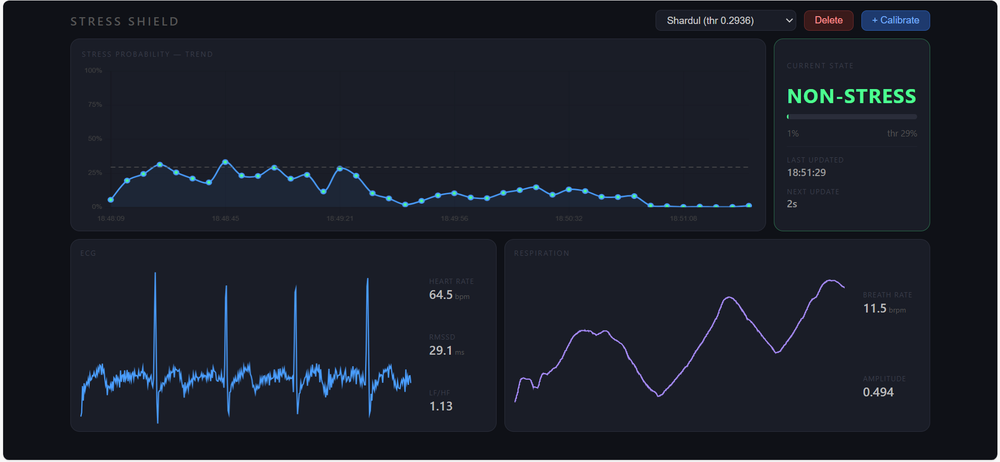

# StressShield

Real-time physiological stress detection from ECG and respiration signals, with a
live web console and per-user calibration.

StressShield reads a BITalino sensor stream over LSL (Lab Streaming Layer),
extracts HRV and respiration features every 5 seconds over a rolling 60-second
window, and classifies the current state as *stress* or *non-stress* using a model
trained on the WESAD dataset.



## Features

- **Live classification** — rolling 60 s window, prediction every 5 s
- **Web console** — stress-probability trend, live ECG and respiration traces, and
  derived metrics (HR, RMSSD, LF/HF, breath rate, breath amplitude), streamed to
  the browser over Server-Sent Events
- **Per-user calibration** — records a relaxed baseline while the user watches a
  calming video, then sets a personal threshold at `baseline_mean + 1.5 × std`
  (capped at 0.95). Profiles are stored in `calibration.json` and can be
  switched or deleted from the UI.
- **CSV export** — record 1–300 s of raw signal and per-window predictions
  (including all extracted features) and download them as CSV
- **Light/dark theme**

## Hardware and setup

| Requirement | Detail |
|---|---|
| Sensor | BITalino with ECG and respiration (PZT) channels |
| Software | OpenSignals (r)evolution, streaming over LSL |
| Sampling rate | 1000 Hz |
| Channels | index 1 = respiration, index 2 = ECG |
| LSL stream name | `OpenSignals` |

These are set as constants at the top of `app.py` — change `CH_ECG`, `CH_RESP`,
`FS`, or `STREAM_NAME` if your acquisition setup differs.

## Installation

```bash
git clone https://github.com/sharduldhande/StressShield.git
cd StressShield
pip install -r requirements.txt
```

Key dependencies: `flask`, `pylsl`, `neurokit2`, `scikit-learn`, `joblib`, `numpy`.

## Usage

1. Connect the BITalino, open OpenSignals, and enable LSL streaming.
2. Verify the stream is visible:

```bash
   python lsl_probe.py
```

3. Start the console:

```bash
   python app.py
```

4. Open <http://localhost:5000>.

The first 60 seconds fill the buffer (progress is shown in the UI) before the
first prediction appears.

For a terminal-only version without the web UI, run `python realtime_stress.py`.

### Calibrating a profile

1. Click **+ Calibrate**, enter a name, and click **Start**.
2. Watch the calibration video and stay relaxed. The last 24 prediction windows
   (2 minutes) are used as the baseline.
3. The computed threshold is saved and the profile becomes selectable from the
   dropdown.

Without a calibration profile the threshold defaults to 0.5.

> The calibration video (`4minbeach.mp4`, referenced as `CALIB_VIDEO_FILE`) is not
> included in the repository — supply your own and place it in the project root.

## Features extracted

**ECG (via `neurokit2.hrv`)** — mean NN, SDNN, RMSSD, pNN50, LF power, HF power,
LF/HF ratio

**Respiration (via `neurokit2.rsp_process`)** — mean, SD, min and max breathing
rate, mean amplitude

Windows where feature extraction fails (poor signal quality) are reported as
errors rather than classified.

## Model

Trained on the [WESAD](https://ubicomp.eti.uni-siegen.de/home/datasets/icmi18/)
dataset; extracted features are in `wesad_features.csv`.

- `stress_model.pkl` — full model including EDA features
- `stress_model_no_eda.pkl` — ECG + respiration only; **this is the one the app loads**,
  since the runtime setup has no EDA channel

Each pickle holds a dict with `model`, `scaler`, and `features` keys.
Retrain the EDA-free model with `python retrain_no_eda.py`.

**Notebooks**

- `stressdetect.ipynb` — feature engineering and model training
- `Explainer.ipynb` — model interpretation and analysis

## API

| Endpoint | Method | Purpose |
|---|---|---|
| `/stream` | GET | SSE stream of predictions, status and calibration events |
| `/signals` | GET | SSE stream of downsampled ECG/respiration samples |
| `/api/profiles` | GET | List calibration profiles |
| `/api/profiles/<name>` | DELETE | Delete a profile |
| `/api/select` | POST | Activate a profile |
| `/api/calibrate` | POST | Begin baseline collection |
| `/api/calibrate/finish` | POST | Compute and save the threshold |
| `/api/export/start` | POST | Begin a timed recording |
| `/api/export/signals` | GET | Download raw signal CSV |
| `/api/export/predictions` | GET | Download prediction + feature CSV |

## Limitations

- Research and educational use only. Not a medical device, and not validated for
  clinical or diagnostic use.
- Trained on WESAD, whose participants and lab-induced stressors may not
  generalise to your users or conditions.
- ECG quality is sensitive to electrode placement and movement; motion artefacts
  will produce dropped windows or unreliable probabilities.
- Single-user, single-stream: the server assumes one connected device.
